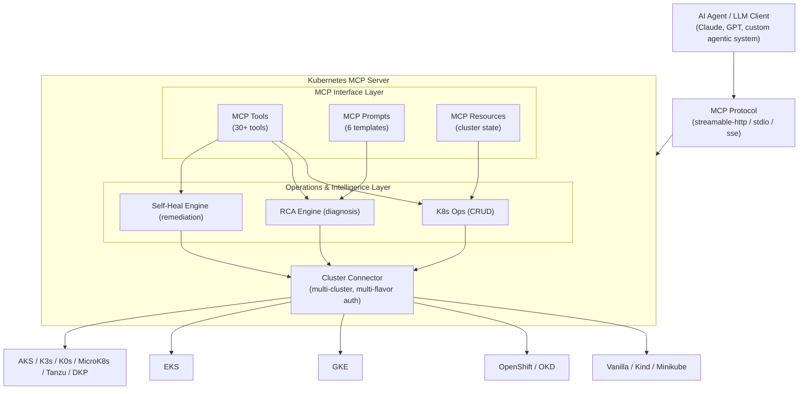
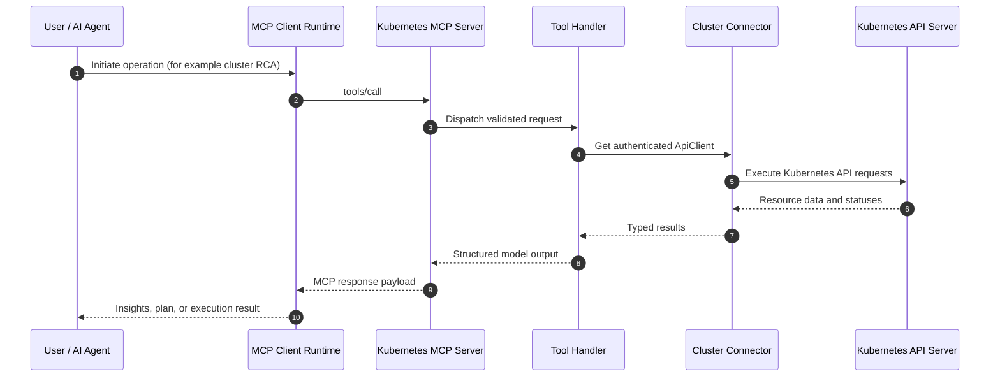
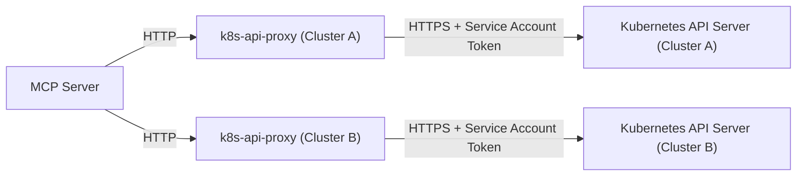
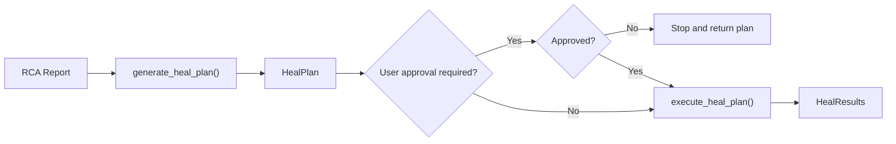
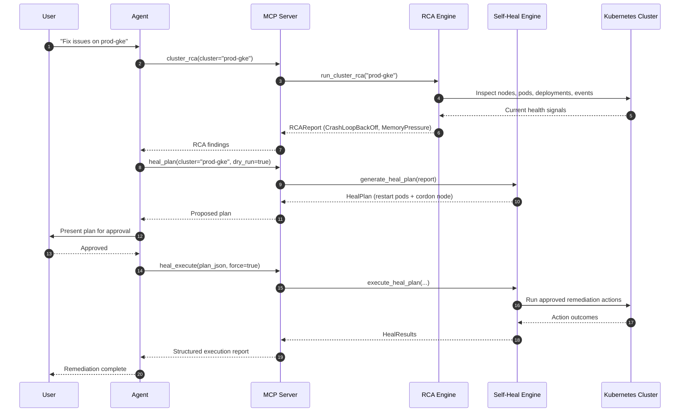
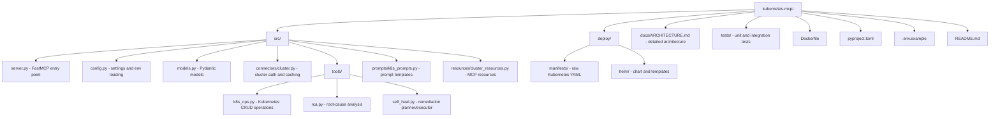

# Kubernetes MCP Server

A **multi-cluster Kubernetes MCP (Model Context Protocol) server** built in Python that enables AI agents to perform **root-cause analysis (RCA)** and **self-healing** across any Kubernetes flavor using service-account-based authentication.

Inspired by [containers/kubernetes-mcp-server](https://github.com/containers/kubernetes-mcp-server) but designed for Python-based agentic systems with additional RCA and self-healing capabilities.

---

## Table of Contents

- [Features](#features)
- [Architecture](#architecture)
- [Supported Kubernetes Flavors](#supported-kubernetes-flavors)
- [Quick Start](#quick-start)
- [Configuration](#configuration)
- [MCP Tools Reference](#mcp-tools-reference)
- [RCA Engine](#rca-engine)
- [Self-Healing Engine](#self-healing-engine)
- [Deployment](#deployment)
- [Service Account Setup per Flavor](#service-account-setup-per-flavor)
- [Client Integration](#client-integration)
- [Development](#development)
- [Community and Security](#community-and-security)
- [License](#license)

---

## Features

| Capability | Description |
|---|---|
| **Multi-Cluster** | Connect to any number of Kubernetes clusters simultaneously |
| **14 K8s Flavors** | Vanilla, OpenShift, Rancher, GKE, EKS, AKS, K3s, K0s, MicroK8s, Kind, Minikube, Tanzu, OKD, DKP |
| **Service Account Auth** | Universal bearer-token authentication across all flavors |
| **Root Cause Analysis** | Automated analysis of pod crashes, node issues, deployment failures |
| **Self-Healing** | Remediation plans with dry-run and approval workflows |
| **MCP Protocol** | Full MCP support with tools, resources, and prompts |
| **Read-Only Mode** | Safety mode that blocks all write operations |
| **Streamable HTTP** | Production transport for agentic systems |

---

## Architecture



### Data Flow



---

## Supported Kubernetes Flavors

| Flavor | Auth Method | Notes |
|--------|-------------|-------|
| **Vanilla K8s** | SA bearer token / kubeconfig | Standard Kubernetes |
| **OpenShift** | SA token + optional OAuth | Supports OCP routes and DeploymentConfigs |
| **Rancher** | SA token + optional Rancher API token | Managed via Rancher server |
| **GKE** | SA token / Workload Identity | Google Kubernetes Engine |
| **EKS** | SA token / IRSA | Amazon Elastic Kubernetes Service |
| **AKS** | SA token / AAD Pod Identity | Azure Kubernetes Service |
| **K3s** | SA token / kubeconfig | Lightweight Kubernetes |
| **K0s** | SA token / kubeconfig | Zero-friction Kubernetes |
| **MicroK8s** | SA token / kubeconfig | Canonical's minimal K8s |
| **Kind** | SA token / kubeconfig | Kubernetes-in-Docker |
| **Minikube** | SA token / kubeconfig | Local development K8s |
| **Tanzu** | SA token / kubeconfig | VMware Tanzu |
| **OKD** | SA token / OAuth | Community OpenShift |
| **DKP** | SA token / kubeconfig | D2iQ Kubernetes Platform |

### Universal Authentication: Service Account Bearer Token

The **service account bearer token** is the universal auth method that works across ALL Kubernetes flavors. Every K8s distribution supports it natively since it's part of the core Kubernetes API.

```bash
# Create a service account and get its token (works on ALL flavors)
kubectl create serviceaccount mcp-server -n kube-system
kubectl create clusterrolebinding mcp-server \
  --clusterrole=cluster-admin \
  --serviceaccount=kube-system:mcp-server

# For K8s 1.24+ (token not auto-created)
kubectl create token mcp-server -n kube-system --duration=87600h
```

---

## Quick Start

### 1. Install

```bash
cd kubernetes-mcp
pip install -e .
```

### 2. Configure

Create a `.env` file (copy from `.env.example`):

```bash
cp .env.example .env
```

Edit `.env` with your cluster configuration:

```env
CLUSTER_REGISTRY='[
  {
    "name": "prod-gke",
    "flavor": "gke",
    "api_server": "https://35.x.x.x",
    "sa_token": "eyJhbGciOiJSUzI1NiIs...",
    "skip_tls_verify": true
  },
  {
    "name": "staging-eks",
    "flavor": "eks",
    "api_server": "https://ABCD.gr7.us-east-1.eks.amazonaws.com",
    "sa_token": "eyJhbGciOiJSUzI1NiIs...",
    "ca_cert": "LS0tLS1CRUdJTi..."
  }
]'
```

### 3. Run

```bash
# Streamable HTTP (production)
export CLUSTER_REGISTRY='[
  {
    "name":"openshift-crc",
    "flavor":"openshift",
    "api_server":"https://api.crc.testing:6443",
    "openshift_oauth_token":"'"$(oc whoami -t)"'",
    "skip_tls_verify":true
  },
  {...}, ...
]'
export MCP_SERVER_HOST=127.0.0.1
export MCP_SERVER_PORT=8080
export MCP_TRANSPORT=streamable-http
PYTHONPATH=. python -m src.server

# stdio (for Claude Desktop, Cursor, etc.)
MCP_TRANSPORT=stdio python -m src.server
```

### 4. Connect an AI Agent

Add to your MCP client configuration (e.g., Claude Desktop `claude_desktop_config.json`):

```json
{
  "mcpServers": {
    "kubernetes": {
      "url": "http://localhost:8080/mcp"
    }
  }
}
```

Or for stdio transport:

```json
{
  "mcpServers": {
    "kubernetes": {
      "command": "python",
      "args": ["-m", "src.server"],
      "cwd": "/path/to/kubernetes-mcp",
      "env": {
        "MCP_TRANSPORT": "stdio",
        "CLUSTER_REGISTRY": "[{\"name\":\"local\",\"flavor\":\"vanilla\",\"api_server\":\"https://localhost:6443\",\"sa_token\":\"...\"}]"
      }
    }
  }
}
```

---

## Configuration

### Environment Variables

| Variable | Default | Description |
|----------|---------|-------------|
| `CLUSTER_REGISTRY` | `[]` | JSON array of cluster configurations |
| `MCP_SERVER_HOST` | `0.0.0.0` | Server bind address |
| `MCP_SERVER_PORT` | `8080` | Server port |
| `MCP_TRANSPORT` | `streamable-http` | Transport: `streamable-http`, `sse`, `stdio` |
| `MCP_LOG_LEVEL` | `info` | Logging level |
| `ENABLE_SELF_HEAL` | `true` | Enable self-healing tools |
| `ENABLE_RCA` | `true` | Enable RCA tools |
| `READ_ONLY` | `false` | Block all write operations |

### Cluster Configuration Schema

Each entry in `CLUSTER_REGISTRY` is a `ClusterConfig` object:

```json
{
  "name": "my-cluster",
  "flavor": "gke",
  "api_server": "https://api.example.com:6443",
  "proxy_url": "http://k8s-api-proxy.k8s-mcp-proxy.svc:8443",
  "sa_token": "eyJhbGciOi...",
  "sa_token_path": "/path/to/token",
  "ca_cert": "base64-encoded-ca-cert",
  "ca_cert_path": "/path/to/ca.crt",
  "kubeconfig_path": "/path/to/kubeconfig",
  "skip_tls_verify": false,
  "openshift_oauth_token": "sha256~...",
  "gke_project_id": "my-gcp-project",
  "eks_cluster_name": "my-eks-cluster",
  "eks_region": "us-east-1",
  "aks_resource_group": "my-rg",
  "rancher_server_url": "https://rancher.example.com",
  "rancher_api_token": "token-xxxxx:yyyyyy"
}
```

**Authentication priority:**
1. `proxy_url` — kubectl proxy or API gateway (no token needed)
2. `sa_token` / `sa_token_path` — direct service account bearer token
3. Flavor-specific credentials (OAuth, Rancher API, etc.)
4. `kubeconfig_path` — standard kubeconfig file
5. In-cluster config — when running inside Kubernetes

---

## API Proxy Mode

When the Kubernetes API server is **not directly accessible** (e.g., behind a firewall, private VPC, air-gapped environment), you can deploy a lightweight **API proxy stub** inside each cluster. The MCP server then connects to this proxy instead.

### Architecture



### How It Works

1. A lightweight Go reverse proxy (`proxy/`) runs as a Deployment in each cluster
2. It uses the pod's auto-mounted **service account token** to authenticate to the API server
3. The token is automatically rotated by Kubernetes — no manual management needed
4. External clients (the MCP server) connect to the proxy over plain HTTP
5. Access is restricted via NetworkPolicy, optional shared secret, or Ingress rules

### Deploying the Proxy

```bash
# Build the proxy image
cd proxy/
docker build -t k8s-api-proxy:latest .

# Deploy to a cluster
kubectl apply -f deploy/proxy/k8s-api-proxy.yaml

# Verify
kubectl get pods -n k8s-mcp-proxy
kubectl logs -n k8s-mcp-proxy -l app.kubernetes.io/name=k8s-api-proxy
```

### Configuring the MCP Server for Proxy Mode

Use `proxy_url` instead of `api_server` + `sa_token`:

```env
CLUSTER_REGISTRY='[
  {
    "name": "prod-gke",
    "flavor": "gke",
    "proxy_url": "http://k8s-api-proxy.k8s-mcp-proxy.svc:8443"
  },
  {
    "name": "staging-eks",
    "flavor": "eks",
    "proxy_url": "https://proxy.staging.example.com:8443"
  }
]'
```

### Local Development with kubectl proxy

For local development, use `kubectl proxy` as the proxy:

```bash
# Start kubectl proxy
kubectl proxy --port=8001

# Configure MCP server
CLUSTER_REGISTRY='[{"name": "local", "flavor": "vanilla", "proxy_url": "http://localhost:8001"}]'
```

### Proxy Configuration

| Environment Variable | Default | Description |
|---------------------|---------|-------------|
| `PROXY_LISTEN` | `:8443` | Address to listen on |
| `KUBERNETES_API_SERVER` | auto-detected | API server URL (auto-detected in-cluster) |
| `SA_TOKEN_PATH` | `/var/run/secrets/.../token` | Path to SA token |
| `SA_CA_CERT_PATH` | `/var/run/secrets/.../ca.crt` | Path to CA certificate |
| `PROXY_AUTH_TOKEN` | *(empty)* | Optional shared secret for access control |
| `PROXY_READ_ONLY` | `false` | Reject mutating HTTP methods |
| `SKIP_TLS_VERIFY` | `false` | Skip API server TLS verification (dev only) |

---

## MCP Tools Reference

### Cluster Management

| Tool | Description | Parameters |
|------|-------------|------------|
| `list_clusters` | List all registered clusters | — |
| `cluster_health` | Health check a cluster | `cluster` |
| `register_cluster` | Add a cluster at runtime | `name`, `api_server?`, `proxy_url?`, `sa_token?`, `flavor?`, `skip_tls_verify?` |

### Namespace Operations

| Tool | Description | Parameters |
|------|-------------|------------|
| `list_namespaces` | List all namespaces | `cluster` |

### Pod Operations

| Tool | Description | Parameters |
|------|-------------|------------|
| `list_pods` | List pods in namespace | `cluster`, `namespace?` |
| `get_pod` | Get pod details | `cluster`, `name`, `namespace?` |
| `get_pod_logs` | Get pod logs | `cluster`, `name`, `namespace?`, `container?`, `tail_lines?`, `previous?` |
| `delete_pod` | Delete a pod | `cluster`, `name`, `namespace?` |
| `restart_pod` | Restart a pod | `cluster`, `name`, `namespace?` |

### Deployment Operations

| Tool | Description | Parameters |
|------|-------------|------------|
| `list_deployments` | List deployments | `cluster`, `namespace?` |
| `get_deployment` | Get deployment details | `cluster`, `name`, `namespace?` |
| `scale_deployment` | Scale replicas | `cluster`, `name`, `replicas`, `namespace?` |
| `restart_deployment` | Rollout restart | `cluster`, `name`, `namespace?` |

### Node Operations

| Tool | Description | Parameters |
|------|-------------|------------|
| `list_nodes` | List cluster nodes | `cluster` |
| `cordon_node` | Mark node unschedulable | `cluster`, `node_name` |
| `uncordon_node` | Mark node schedulable | `cluster`, `node_name` |

### Events & Services

| Tool | Description | Parameters |
|------|-------------|------------|
| `list_events` | List namespace events | `cluster`, `namespace?` |
| `list_services` | List services | `cluster`, `namespace?` |
| `list_configmaps` | List ConfigMaps | `cluster`, `namespace?` |
| `get_configmap` | Get ConfigMap data | `cluster`, `name`, `namespace?` |
| `list_secrets` | List secrets (no data) | `cluster`, `namespace?` |

### Generic Resources

| Tool | Description | Parameters |
|------|-------------|------------|
| `get_resource` | Get any resource | `cluster`, `api_version`, `kind`, `name`, `namespace?` |
| `list_resources` | List any resources | `cluster`, `api_version`, `kind`, `namespace?` |
| `create_or_update_resource` | Apply a manifest | `cluster`, `manifest` |
| `delete_resource` | Delete any resource | `cluster`, `api_version`, `kind`, `name`, `namespace?` |

### RCA Tools

| Tool | Description | Parameters |
|------|-------------|------------|
| `cluster_rca` | Full cluster RCA scan | `cluster` |
| `pod_rca` | Pod-focused RCA | `cluster`, `name`, `namespace?` |
| `namespace_rca` | Namespace-focused RCA | `cluster`, `namespace` |

### Self-Healing Tools

| Tool | Description | Parameters |
|------|-------------|------------|
| `heal_plan` | Generate healing plan | `cluster`, `dry_run?`, `requires_approval?` |
| `heal_execute` | Execute healing plan | `cluster`, `plan_json`, `force?` |
| `heal_quick` | Single quick action | `cluster`, `action_type`, `resource`, `namespace?`, `dry_run?` |

---

## RCA Engine

The RCA engine performs automated root-cause analysis by inspecting:

### Checks Performed

1. **Unhealthy Nodes** — NotReady, MemoryPressure, DiskPressure, PIDPressure
2. **Failing Pods** — CrashLoopBackOff, ImagePullBackOff, ErrImagePull, CreateContainerConfigError
3. **Pending Pods** — Scheduling failures, resource constraints
4. **Deployment Issues** — Under-replicated deployments
5. **Warning Events** — Aggregated warning events across the cluster
6. **Resource Pressure** — Node-level resource exhaustion

### RCA Report Structure

```json
{
  "cluster_name": "prod-gke",
  "summary": "Cluster 'prod-gke' has 3 issue(s). Most severe: CrashLoopBackOff on pod/default/api-server-xyz",
  "conditions": [
    {
      "type": "CrashLoopBackOff",
      "resource": "pod/default/api-server-xyz",
      "namespace": "default",
      "message": "Back-off restarting failed container",
      "severity": "error"
    }
  ],
  "probable_root_cause": "2 container(s) in CrashLoopBackOff",
  "recommended_actions": [
    "Check pod logs: kubectl logs <pod> --previous",
    "Review application configuration (ConfigMaps, Secrets, env vars)",
    "Check resource limits – OOMKilled containers need more memory"
  ],
  "affected_resources": ["pod/default/api-server-xyz"]
}
```

### RCA Scope Levels

| Scope | Tool | What it checks |
|-------|------|----------------|
| **Cluster** | `cluster_rca` | All nodes, all pods, all deployments, all events |
| **Namespace** | `namespace_rca` | Pods, deployments, events in a specific namespace |
| **Pod** | `pod_rca` | Pod status, container states, restarts, events, logs |

---

## Self-Healing Engine

The self-healing engine translates RCA findings into actionable remediation plans.

### Workflow



### Supported Actions

| Action | Description | Triggered By |
|--------|-------------|--------------|
| `restart_pod` | Delete pod for controller recreation | CrashLoopBackOff, high restarts, container errors |
| `rollout_restart` | Restart all pods in a deployment | Under-replicated, pending pods |
| `scale_deployment` | Adjust replica count | Resource constraints |
| `cordon_node` | Mark node unschedulable | NodeNotReady, resource pressure |
| `drain_node` | Evict all pods from node | NodeNotReady |
| `uncordon_node` | Make node schedulable again | After node recovery |

### Safety Controls

- **`dry_run=True`** (default) — Plan shows what *would* happen without executing
- **`requires_approval=True`** (default) — Agent must present plan to user before execution
- **`read_only=True`** — Server-wide block on all write operations
- **Force flag** — Explicit `force=True` required to bypass approval

### Example: AI-Driven Self-Healing Flow



---

## Deployment

### Local Development

```bash
pip install -e .
python -m src.server
```

### Docker

```bash
docker build -t kubernetes-mcp-server:latest .
docker run -p 8080:8080 \
  -e CLUSTER_REGISTRY='[{"name":"local","flavor":"vanilla","api_server":"https://host.docker.internal:6443","sa_token":"..."}]' \
  kubernetes-mcp-server:latest
```

### Kubernetes (Raw Manifests)

```bash
# Apply all manifests
kubectl apply -f deploy/manifests/

# Verify
kubectl get pods -n kubernetes-mcp
```

### Kubernetes (Helm)

```bash
# Install with defaults (connects to local cluster via in-cluster config)
helm install kubernetes-mcp deploy/helm/ -n kubernetes-mcp --create-namespace

# Install with custom values
helm install kubernetes-mcp deploy/helm/ -n kubernetes-mcp --create-namespace \
  --set features.enableSelfHeal=true \
  --set server.readOnly=false \
  --set-string clusterRegistry='[{"name":"prod","flavor":"gke","api_server":"https://...","sa_token":"..."}]'
```

### In-Cluster Deployment

When deployed inside a Kubernetes cluster, the MCP server can use the mounted service account token to connect to its own cluster automatically:

```json
[{
  "name": "local",
  "flavor": "vanilla",
  "api_server": "https://kubernetes.default.svc",
  "sa_token_path": "/var/run/secrets/kubernetes.io/serviceaccount/token",
  "ca_cert_path": "/var/run/secrets/kubernetes.io/serviceaccount/ca.crt"
}]
```

---

## Service Account Setup per Flavor

### Vanilla Kubernetes / K3s / K0s / MicroK8s / Kind / Minikube

```bash
# Create service account
kubectl create serviceaccount mcp-server -n kube-system

# Bind cluster-admin (or a custom scoped role)
kubectl create clusterrolebinding mcp-server-binding \
  --clusterrole=cluster-admin \
  --serviceaccount=kube-system:mcp-server

# Get token (K8s 1.24+)
TOKEN=$(kubectl create token mcp-server -n kube-system --duration=87600h)

# Get CA cert
CA=$(kubectl get secret -n kube-system -o jsonpath='{.items[?(@.metadata.annotations.kubernetes\.io/service-account\.name=="mcp-server")].data.ca\.crt}')

# Get API server
API_SERVER=$(kubectl config view -o jsonpath='{.clusters[0].cluster.server}')

echo "api_server: $API_SERVER"
echo "sa_token: $TOKEN"
```

### OpenShift / OKD

```bash
# Create service account
oc create serviceaccount mcp-server -n openshift-infra

# Add cluster-admin role
oc adm policy add-cluster-role-to-user cluster-admin -z mcp-server -n openshift-infra

# Get token
TOKEN=$(oc create token mcp-server -n openshift-infra --duration=87600h)

# Get API server
API_SERVER=$(oc whoami --show-server)

echo "api_server: $API_SERVER"
echo "sa_token: $TOKEN"
echo "flavor: openshift"
```

### GKE (Google Kubernetes Engine)

```bash
# Get cluster credentials
gcloud container clusters get-credentials CLUSTER_NAME --zone ZONE --project PROJECT

# Create service account
kubectl create serviceaccount mcp-server -n kube-system
kubectl create clusterrolebinding mcp-server-binding \
  --clusterrole=cluster-admin \
  --serviceaccount=kube-system:mcp-server

# Get token
TOKEN=$(kubectl create token mcp-server -n kube-system --duration=87600h)

# Get API server endpoint
API_SERVER=$(gcloud container clusters describe CLUSTER_NAME --zone ZONE --format="value(endpoint)")

echo "api_server: https://$API_SERVER"
echo "sa_token: $TOKEN"
echo "flavor: gke"
echo "gke_project_id: PROJECT"
```

### EKS (Amazon Elastic Kubernetes Service)

```bash
# Update kubeconfig
aws eks update-kubeconfig --name CLUSTER_NAME --region REGION

# Create service account
kubectl create serviceaccount mcp-server -n kube-system
kubectl create clusterrolebinding mcp-server-binding \
  --clusterrole=cluster-admin \
  --serviceaccount=kube-system:mcp-server

# Get token
TOKEN=$(kubectl create token mcp-server -n kube-system --duration=87600h)

# Get API server
API_SERVER=$(aws eks describe-cluster --name CLUSTER_NAME --region REGION --query 'cluster.endpoint' --output text)
CA_DATA=$(aws eks describe-cluster --name CLUSTER_NAME --region REGION --query 'cluster.certificateAuthority.data' --output text)

echo "api_server: $API_SERVER"
echo "sa_token: $TOKEN"
echo "ca_cert: $CA_DATA"
echo "flavor: eks"
echo "eks_cluster_name: CLUSTER_NAME"
echo "eks_region: REGION"
```

### AKS (Azure Kubernetes Service)

```bash
# Get credentials
az aks get-credentials --resource-group RG_NAME --name CLUSTER_NAME

# Create service account
kubectl create serviceaccount mcp-server -n kube-system
kubectl create clusterrolebinding mcp-server-binding \
  --clusterrole=cluster-admin \
  --serviceaccount=kube-system:mcp-server

# Get token
TOKEN=$(kubectl create token mcp-server -n kube-system --duration=87600h)

# Get API server
API_SERVER=$(az aks show --resource-group RG_NAME --name CLUSTER_NAME --query fqdn -o tsv)

echo "api_server: https://$API_SERVER"
echo "sa_token: $TOKEN"
echo "flavor: aks"
echo "aks_resource_group: RG_NAME"
```

### Rancher-Managed Clusters

```bash
# Option 1: Use SA token (same as vanilla K8s)
kubectl create serviceaccount mcp-server -n kube-system
kubectl create clusterrolebinding mcp-server-binding \
  --clusterrole=cluster-admin \
  --serviceaccount=kube-system:mcp-server
TOKEN=$(kubectl create token mcp-server -n kube-system --duration=87600h)

# Option 2: Use Rancher API token
# Create in Rancher UI → User Avatar → API & Keys → Add Key
# This gives you a token like: token-xxxxx:yyyyyy

echo "flavor: rancher"
echo "rancher_server_url: https://rancher.example.com"
echo "rancher_api_token: token-xxxxx:yyyyyy"
```

### Tanzu / DKP

```bash
# Same as vanilla K8s – SA tokens work universally
kubectl create serviceaccount mcp-server -n kube-system
kubectl create clusterrolebinding mcp-server-binding \
  --clusterrole=cluster-admin \
  --serviceaccount=kube-system:mcp-server
TOKEN=$(kubectl create token mcp-server -n kube-system --duration=87600h)

echo "flavor: tanzu"  # or "dkp"
echo "sa_token: $TOKEN"
```

---

## Client Integration

### Claude Desktop

Add to `~/Library/Application Support/Claude/claude_desktop_config.json`:

```json
{
  "mcpServers": {
    "kubernetes": {
      "url": "http://localhost:8080/mcp"
    }
  }
}
```

### Cursor / VS Code

Add to MCP server settings:

```json
{
  "mcp": {
    "servers": {
      "kubernetes": {
        "url": "http://localhost:8080/mcp"
      }
    }
  }
}
```

### Python (programmatic)

```python
from mcp import ClientSession
from mcp.client.streamable_http import streamablehttp_client

async with streamablehttp_client("http://localhost:8080/mcp") as (read, write, _):
    async with ClientSession(read, write) as session:
        await session.initialize()

        # List clusters
        result = await session.call_tool("list_clusters", {})
        print(result)

        # Run RCA
        result = await session.call_tool("cluster_rca", {"cluster": "prod-gke"})
        print(result)
```

---

## Development

### Project Structure



### Running Tests

```bash
pip install -e ".[dev]"
PYTHONPATH=. pytest tests/test_server.py -q
```

### Adding a New Tool

1. Add the operation function in `src/tools/k8s_ops.py`
2. Register it in `src/server.py` with `@mcp.tool()`
3. Handle `read_only` mode if it's a write operation

```python
# In src/server.py
@mcp.tool()
def my_new_tool(cluster: str, param: str) -> dict:
    """Description shown to AI agents."""
    if settings.read_only:
        return {"error": "Server is in read-only mode."}
    return k8s_ops.my_new_operation(cluster, param)
```

---

  ## Community and Security

  - Contributor Guide: `CONTRIBUTING.md`
  - Code of Conduct: `CODE_OF_CONDUCT.md`
  - Security Policy: `SECURITY.md`
  - Support Channels: `SUPPORT.md`
  - Changelog: `CHANGELOG.md`
  - Open-source checklist: `docs/OPEN_SOURCE_READINESS.md`

  Repository automation:

  - CI workflow: `.github/workflows/ci.yml`
  - CodeQL scanning: `.github/workflows/codeql.yml`
  - OpenSSF Scorecards: `.github/workflows/scorecards.yml`
  - Dependabot updates: `.github/dependabot.yml`

  ---

## Comparison with containers/kubernetes-mcp-server

| Feature | containers/kubernetes-mcp-server | This Project |
|---------|----------------------------------|--------------|
| Language | Go | Python |
| MCP SDK | Go MCP SDK | Python MCP SDK (FastMCP) |
| Multi-cluster | Via kubeconfig contexts | Via cluster registry (SA tokens) |
| RCA Engine | ❌ | ✅ Automated diagnosis |
| Self-Healing | ❌ | ✅ With dry-run & approval |
| Prompts | ❌ | ✅ 6 workflow templates |
| Read-only Mode | ✅ | ✅ |
| Helm Chart | ✅ | ✅ |
| Toolsets | Fixed (core, helm, etc.) | Extensible via decorators |
| Transport | stdio, streamable-http | stdio, streamable-http, sse |

---

## License

Apache-2.0
