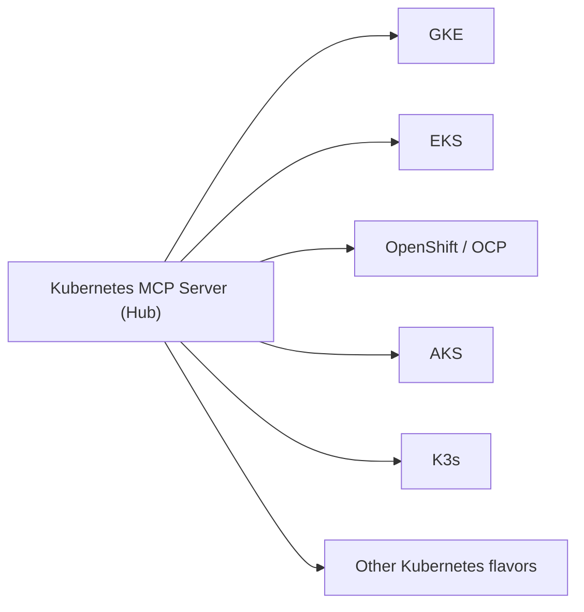
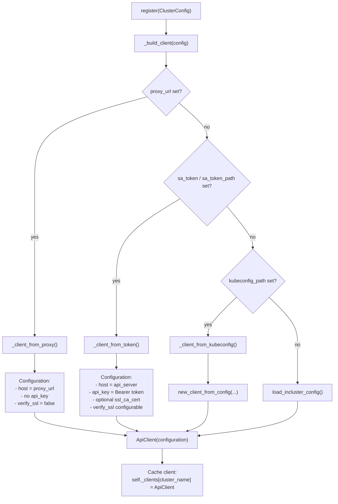
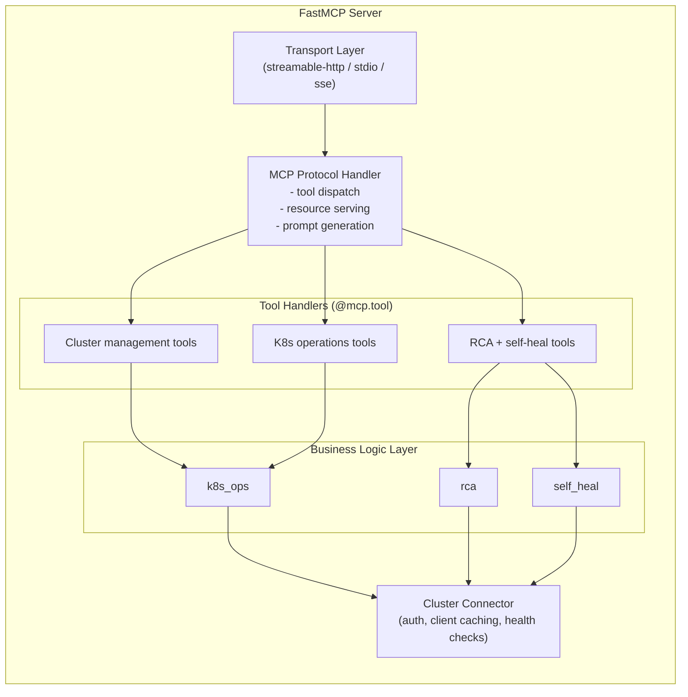
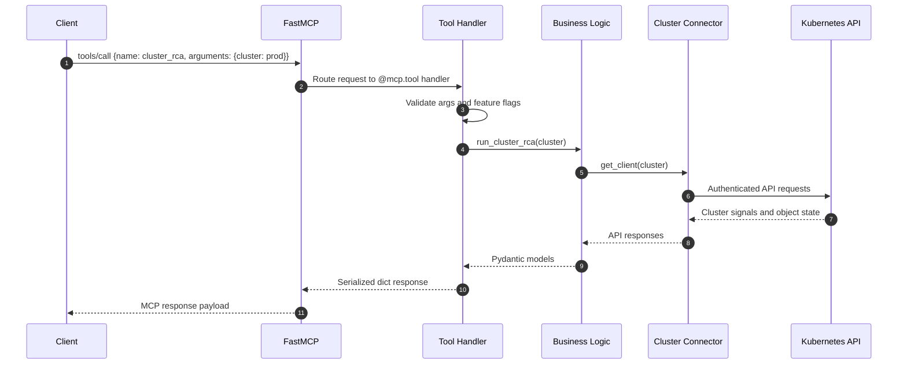
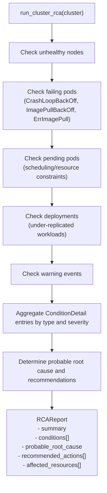
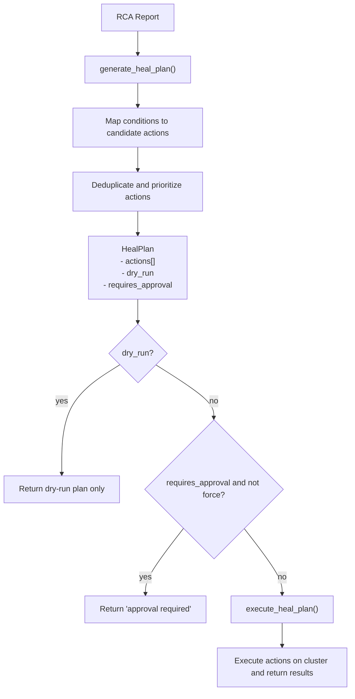
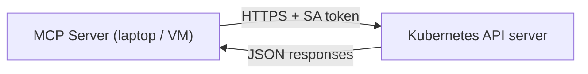
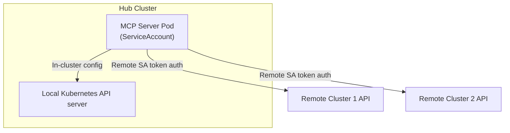
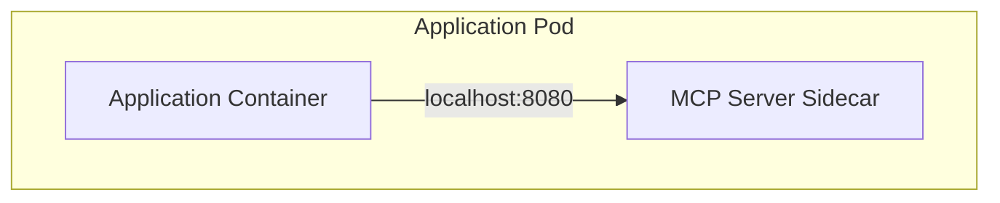
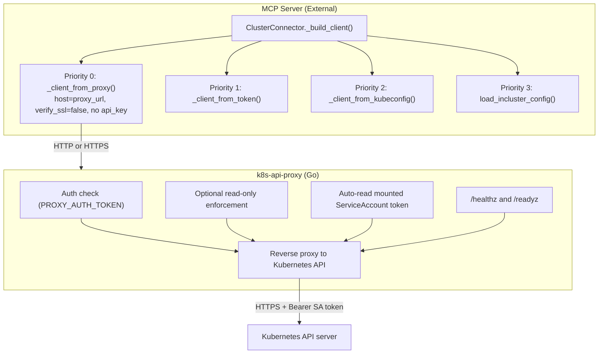

# Architecture – Kubernetes MCP Server

## Overview

This document describes the architecture of the multi-cluster Kubernetes MCP Server, covering connectivity patterns across Kubernetes flavors, the RCA and self-healing engines, and deployment topologies.

---

## 1. Multi-Cluster Connectivity

### 1.1 Hub-and-Spoke Model

The MCP server operates as a **hub** that connects to multiple Kubernetes clusters (**spokes**). Each spoke is an independent Kubernetes cluster of any flavor.



### 1.2 Authentication Flow



### 1.3 Service Account Token — The Universal Approach

Every Kubernetes distribution exposes the same API server interface and supports bearer token authentication. The service account token is a **JWT** signed by the cluster's certificate authority that encodes:

- Service account identity (`system:serviceaccount:<namespace>:<name>`)
- Token expiry (configurable, default 1 hour for bound tokens)
- Audience restrictions

**Why this works universally:**

| Layer | Standard | Supported By |
|-------|----------|--------------|
| API Server | Bearer token auth | All K8s distributions |
| RBAC | ClusterRole/ClusterRoleBinding | All K8s distributions |
| SA Tokens | TokenRequest API (1.24+) | All modern K8s distributions |
| TLS | x509 CA certificate | All K8s distributions |

**Flavor-specific additions** (optional, not required):
- **OpenShift**: OAuth tokens for console access
- **Rancher**: Rancher API tokens for Rancher-managed operations
- **GKE/EKS/AKS**: Cloud IAM for non-SA workflows (Workload Identity, IRSA, AAD)

### 1.4 Connection Configuration Examples

#### Multi-Cluster Production Setup

```json
[
  {
    "name": "prod-us-east",
    "flavor": "eks",
    "api_server": "https://ABCDEF.gr7.us-east-1.eks.amazonaws.com",
    "sa_token": "eyJhbGciOiJSUzI1NiIs...",
    "ca_cert": "LS0tLS1CRUdJTi...",
    "eks_cluster_name": "prod-us-east",
    "eks_region": "us-east-1"
  },
  {
    "name": "prod-eu-west",
    "flavor": "gke",
    "api_server": "https://35.195.x.x",
    "sa_token": "eyJhbGciOiJSUzI1NiIs...",
    "skip_tls_verify": true,
    "gke_project_id": "my-project-prod"
  },
  {
    "name": "staging",
    "flavor": "openshift",
    "api_server": "https://api.staging.ocp.example.com:6443",
    "sa_token": "eyJhbGciOiJSUzI1NiIs...",
    "ca_cert_path": "/certs/ocp-staging-ca.crt"
  },
  {
    "name": "edge-sites",
    "flavor": "k3s",
    "api_server": "https://10.0.1.100:6443",
    "sa_token": "eyJhbGciOiJSUzI1NiIs...",
    "skip_tls_verify": true
  }
]
```

---

## 2. MCP Server Architecture

### 2.1 Component Stack



### 2.2 Request Lifecycle



### 2.3 Lifespan Management

The server uses FastMCP's lifespan pattern to initialise cluster connections at startup:

```python
@asynccontextmanager
async def lifespan(server: FastMCP):
    # Startup: register all clusters from config
    for cfg in settings.cluster_registry:
        connector.register(cfg)
        connector.health_check(cfg.name)
    
    yield {"connector": connector}
    
    # Shutdown: cleanup
```

---

## 3. RCA Engine Design

### 3.1 Analysis Pipeline



### 3.2 Severity Classification

| Severity | Conditions |
|----------|------------|
| **critical** | NodeNotReady |
| **error** | CrashLoopBackOff, ImagePullBackOff, ContainerTerminatedError, HighRestartCount, DeploymentUnderReplicated (0 available) |
| **warning** | PodPending, DeploymentUnderReplicated (partial), Warning events |
| **info** | Informational observations |

---

## 4. Self-Healing Design

### 4.1 Plan-Execute Model



### 4.2 Action Safety Matrix

| Action | Risk | Requires Controller | Reversible |
|--------|------|---------------------|------------|
| restart_pod | Low | Yes (Deployment/RS) | Yes |
| rollout_restart | Low | N/A | Yes |
| scale_deployment | Medium | N/A | Yes |
| cordon_node | Medium | N/A | Yes (uncordon) |
| drain_node | High | N/A | Partial |
| uncordon_node | Low | N/A | Yes |

---

## 5. Deployment Topologies

### 5.1 External (Out-of-Cluster)



Best for: Development, local testing, CI/CD pipelines.

### 5.2 In-Cluster (Hub)



Best for: Production multi-cluster management.

### 5.3 Sidecar



Best for: Single-cluster AI agents running in K8s.

### 5.4 API Proxy Mode (Unexposed API Servers)

When the Kubernetes API server is not directly reachable (private VPC, air-gapped, firewall), deploy the **k8s-api-proxy** stub inside each cluster:



**When to use proxy mode:**
- API server is behind a private VPC or firewall
- Air-gapped environments with no direct connectivity
- Organizations that do not allow external SA token distribution
- Multi-cloud setups where API server endpoints are not routable

**Security:** The proxy uses a NetworkPolicy to restrict access, supports an optional shared secret (`PROXY_AUTH_TOKEN`), and runs as a non-root scratch container. SA tokens are auto-rotated by Kubernetes.

**Supported environments:** GKE, EKS, AKS, OpenShift, K3s, Kind, and any standard Kubernetes distribution.

---

## 6. Security Considerations

### 6.1 Token Management

- Use **bound service account tokens** (TokenRequest API) with short expiry for human operators
- Use **long-lived tokens** only for persistent MCP server deployments
- Rotate tokens on a regular schedule
- Store tokens in Kubernetes Secrets or external secret managers (Vault, AWS Secrets Manager)

### 6.2 RBAC Principle of Least Privilege

Instead of `cluster-admin`, create a scoped ClusterRole:

```yaml
apiVersion: rbac.authorization.k8s.io/v1
kind: ClusterRole
metadata:
  name: mcp-server-readonly
rules:
  - apiGroups: [""]
    resources: [pods, pods/log, events, nodes, services, namespaces]
    verbs: [get, list, watch]
  - apiGroups: [apps]
    resources: [deployments, replicasets, statefulsets]
    verbs: [get, list, watch]
```

### 6.3 Network Security

- Always use TLS for API server communication
- Set `skip_tls_verify: false` in production and provide CA certs
- Use network policies to restrict MCP server egress to API server endpoints only
- For streamable-http transport, consider adding authentication (OAuth 2.1 supported by MCP SDK)

### 6.4 Read-Only Mode

Enable `READ_ONLY=true` for monitoring-only deployments that should never modify cluster state. This blocks:
- Pod deletion/restart
- Deployment scaling/restart
- Node cordon/drain/uncordon
- Resource creation/update/deletion
- Self-healing execution (plans can still be generated)

---

## 7. Extensibility

### Adding New K8s Flavors

1. Add the flavor to `K8sFlavor` enum in `models.py`
2. Add flavor-specific config fields to `ClusterConfig`
3. Handle the flavor in `ClusterConnector._build_client()` if it requires special auth

### Adding Custom RCA Checks

1. Add a `_check_*` function in `rca.py`
2. Call it from `run_cluster_rca()`
3. Map new condition types in `_determine_root_cause()`

### Adding Custom Heal Actions

1. Add an executor function `_exec_*` in `self_heal.py`
2. Register it in `_EXECUTORS` dict
3. Map conditions to actions in `_actions_for_condition()`
