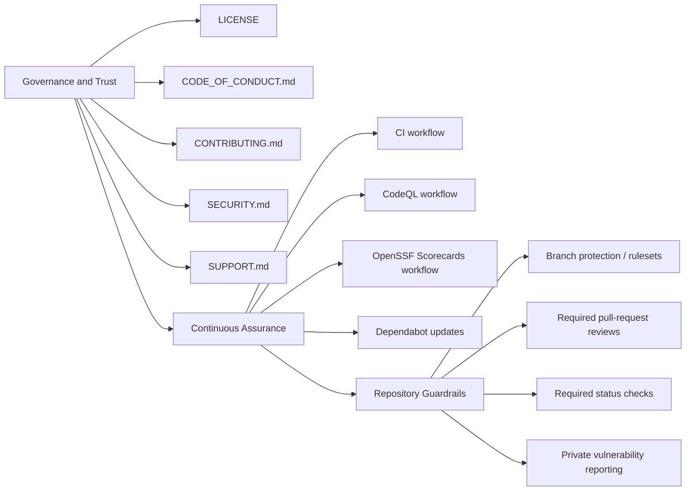

# Open Source Readiness Checklist

This checklist captures controls for publishing and maintaining the repository as
a public project.

## Implemented in Repository

- License file (`LICENSE`, Apache-2.0)
- Contributor guide (`CONTRIBUTING.md`)
- Code of conduct (`CODE_OF_CONDUCT.md`)
- Security policy (`SECURITY.md`)
- Support resources (`SUPPORT.md`)
- Changelog scaffold (`CHANGELOG.md`)
- Issue and PR templates (`.github/ISSUE_TEMPLATE/*`,
  `.github/pull_request_template.md`)
- CODEOWNERS (`.github/CODEOWNERS`)
- Dependabot (`.github/dependabot.yml`)
- CI workflow (`.github/workflows/ci.yml`)
- CodeQL workflow (`.github/workflows/codeql.yml`)
- OpenSSF Scorecards workflow (`.github/workflows/scorecards.yml`)

## Readiness Control Map

## Required Repository Settings (Manual)

Configure these in GitHub repository settings:

1. Enable branch protection or rulesets for default branch
2. Require pull requests before merging
3. Require at least one approving review
4. Require status checks to pass before merge (`CI`, `CodeQL`)
5. Restrict force pushes and branch deletion
6. Optionally require Code Owner review
7. Enable Dependabot alerts and secret scanning
8. Enable private vulnerability reporting
9. Restrict GitHub Actions permissions to least privilege by default

## Release/Supply Chain (Recommended)

1. Add signed release artifacts
2. Publish package artifacts from tagged releases
3. Generate and attach SBOM for each release
4. Add provenance/attestation for build artifacts