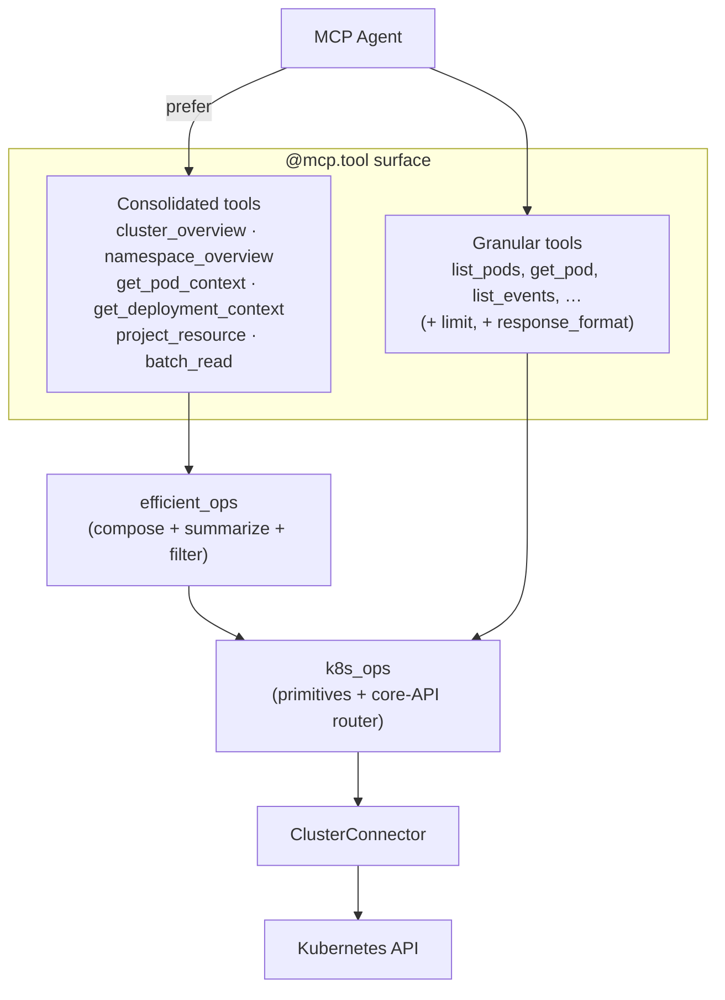
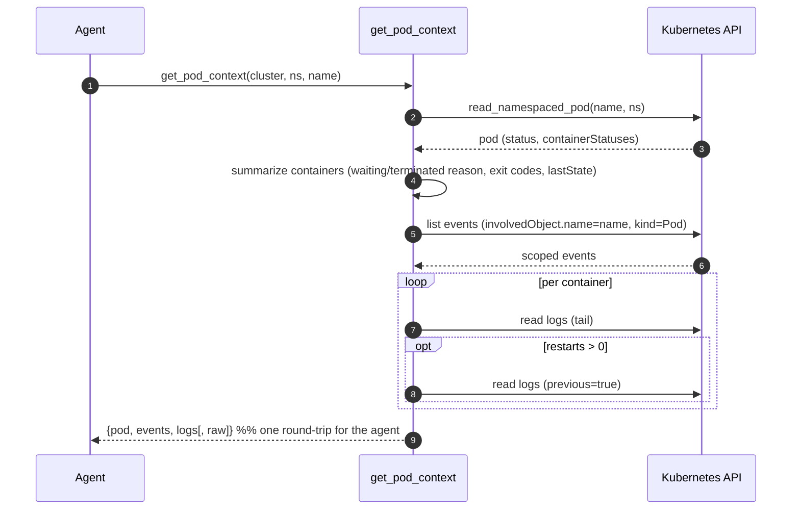

# Token- & Tool-Call Efficiency Design

> HLD + LLD for the consolidated / token-efficient tool layer added to the
> Kubernetes MCP Server. The design is grounded in Anthropic's published
> guidance on agent tooling (see [§2 Research basis](#2-research-basis)) and
> validated against a live cluster (see [§6 Measured results](#6-measured-results)).

---

## 1. Problem statement

An MCP agent pays for tools in two places, and both grow with the number of
tool calls:

1. **Tool-definition tokens.** Every tool's schema is loaded into the context
   window up front.
2. **Intermediate-result tokens.** Every tool *result* flows back through the
   model, even when the agent only needs one field of it.

A naive Kubernetes tool surface makes this worse because real tasks are
*multi-step*. Triaging one failing pod typically means: `get_pod` →
`describe_resource` → `get_pod_logs` (→ previous logs) → `list_events` — four or
five round-trips, each returning a large object, most of which the model never
uses. Listing tools (`list_pods`, `list_deployments`, …) return *every* object
with full labels/annotations/spec, which is the dominant token cost on busy
namespaces.

This is the exact failure mode Anthropic describes: bloated context causes
**context rot** — "as the number of tokens in the context window increases, the
model's ability to accurately recall information from that context decreases"
([Effective context engineering][ctx]).

---

## 2. Research basis

All three sources are Anthropic Engineering publications. The techniques below
are applied, not invented here.

| # | Technique | Source | Key evidence |
|---|-----------|--------|--------------|
| T1 | **Consolidate related operations into high-impact tools** — e.g. one `get_customer_context` instead of `get_customer_by_id` + `list_transactions` + `list_notes`. | [Writing tools for agents][tools] | "implement a `get_customer_context` tool which compiles all of a customer's recent & relevant information all at once." |
| T2 | **Return the smallest set of high-signal tokens**; expose a `response_format` enum (`concise`/`detailed`). | [Writing tools][tools], [Context engineering][ctx] | Detailed 206 tokens vs concise 72 tokens (~⅓); "find the *smallest* possible set of high-signal tokens." |
| T3 | **Pagination / filtering / truncation with sensible defaults**; steer agents toward "many small and targeted searches." | [Writing tools][tools] | "implement pagination, range selection, filtering, and/or truncation." |
| T4 | **Filter & transform data before it reaches the model** (in the execution environment). | [Code execution with MCP][code] | filtering 10,000 spreadsheet rows to 5 in code rather than letting "all rows flow through context." |
| T5 | **Avoid chaining individual tool calls**; use code/control-flow to fan out. | [Code execution with MCP][code] | "Loops, conditionals, and error handling … rather than chaining individual tool calls." (Headline result: 150,000 → 2,000 tokens, **98.7%**.) |
| T6 | **High-signal, human-readable output**; drop low-level identifiers; actionable errors. | [Writing tools][tools] | "eschew low-level technical identifiers (uuid, 256px_image_url, mime_type)." |
| T7 | **Steer the agent with instructions** toward token-efficient tools. | [Writing tools][tools], [Context engineering][ctx] | "directly encourage agents to pursue more token-efficient strategies." |

[code]: https://www.anthropic.com/engineering/code-execution-with-mcp
[tools]: https://www.anthropic.com/engineering/writing-tools-for-agents
[ctx]: https://www.anthropic.com/engineering/effective-context-engineering-for-ai-agents

---

## 3. High-level design (HLD)

A new **consolidation layer** (`src/tools/efficient_ops.py`) sits *beside* the
granular operations and *above* the connector. It composes existing read
primitives into single high-signal calls. No granular tool is removed —
back-compatibility is preserved; the consolidated tools are the recommended
default and the server `instructions` steer agents to them (T7).



**Design rules**

- **Read-only & safe.** Everything in the consolidation layer is read-only, so
  it is independent of `READ_ONLY` mode. `batch_read` dispatches through an
  explicit *allow-list* of read operations; mutating verbs are unreachable.
- **Concise by default (T2).** Consolidated tools default to `concise`; the
  caller opts into `detailed` (which appends the raw object) only when needed.
- **Compose, don't duplicate.** Consolidated tools call the existing
  `k8s_ops`/connector primitives; summarization logic lives in one place.

---

## 4. Low-level design (LLD)

### 4.1 New tools

| Tool | Replaces (calls) | Returns (concise) |
|------|------------------|-------------------|
| `cluster_overview(cluster)` | `list_nodes` + `list_namespaces` + `list_event(Warning)` | node ready/total, problem nodes, ns count, recent warnings. Intentionally avoids the all-pod listing the full health check does. |
| `namespace_overview(cluster, namespace)` | `list_pods` + `list_deployments` + `list_events` + `list_pvcs` + `list_services` (+ filtering) | pod phase counts, **problem pods only**, unhealthy deployments, unbound PVCs, service count, recent warnings. |
| `get_pod_context(cluster, name, …)` | `get_pod` + `describe_resource` + `get_pod_logs` (+ previous) + `list_events` | status, **per-container failure reasons/exit codes**, owners, conditions, scoped events, log tails. Previous-instance logs are fetched automatically when a container has restarted (where the crash evidence is). |
| `get_deployment_context(cluster, name, …)` | `get_deployment` + `get_rollout_status` + `list_pods` + `list_events` | deployment summary, rollout progress/conditions, owned pods (concise), recent events. |
| `project_resource(cluster, api_version, kind, name, fields, …)` | `get_resource` + client-side field extraction | only the requested dotted-path fields (T4). |
| `batch_read(cluster, operations[])` | N separate read calls | one result per op; a failure in one op does not abort the rest (T5). |

### 4.2 Granular-tool changes (T2/T3)

- `list_pods`, `list_resources`: new `limit: int = 0` (0 = unchanged) → passed to
  the API server to cap result size.
- `get_pod`: new `response_format = "detailed" | "concise"` (default `detailed`
  preserves prior behavior; `concise` returns a ~10× smaller summary).

### 4.3 `batch_read` dispatch

```
operations = [{"op": "<name>", "args": {...}}, ...]   # args exclude `cluster`
for spec in operations:
    fn = ALLOWLIST.get(spec.op)            # read-only allow-list
    if not fn: -> {op, ok:false, error:"unknown or non-readonly op"}
    try:      -> {op, ok:true,  result: fn(cluster, **spec.args)}
    except e: -> {op, ok:false, error: str(e)}   # isolated per op
```

The allow-list is the security boundary: `delete_pod`, `scale_deployment`,
`cordon_node`, `create_or_update_resource`, `exec_pod`, … are **not** present
(asserted by a unit test).

### 4.4 `get_pod_context` sequence



### 4.5 Core-API routing fix (correctness, enables `project_resource`)

The generic `get_resource`/`list_resources` previously routed **all** kinds
through `CustomObjectsApi`, which only serves grouped APIs at
`/apis/{group}/{version}/…`. Core kinds (`Pod`, `Service`, `Node`, …) have an
empty group and live at `/api/{version}/…`, so those calls **404'd**. A new
`_core_api_request()` helper issues the request against the correct core path
when `group == ""`; grouped CRDs are unchanged. This is what makes
`project_resource`/`get_resource`/`describe_resource` work for core kinds.

---

## 5. Trade-offs & what we deliberately did *not* do

- **No arbitrary code-execution tool.** Anthropic's headline 98.7% result comes
  from letting the model run code against MCP servers ([Code execution][code]).
  Exposing an arbitrary Python/exec tool on a *cluster-admin-capable* server is
  an unacceptable RCE surface. We instead implement the **safe subset** of that
  benefit: server-side filtering (`project_resource`, T4) and one-round-trip
  fan-out (`batch_read`, T5) over a read-only allow-list. This captures most of
  the call-count win without arbitrary execution.
- **Granular tools retained.** Removing them would break existing clients and
  reduce flexibility; we steer rather than delete (T7).
- **`get_pod` default stays `detailed`.** Changing an existing default is a
  breaking change; new consolidated tools default to `concise` instead.

---

## 6. Measured results

Validated against a live `docker-desktop` cluster (Kubernetes v1.34), both from
the host and from the built Docker image (see below). Character counts are a
proxy for tokens (~4 chars/token).

| Scenario | Before | After | Reduction |
|----------|--------|-------|-----------|
| `get_pod` payload (concise vs detailed) | 14,357 chars (~3.6k tok) | 258 chars (~65 tok) | **98.2%** |
| `project_resource` (2 fields of a Pod) | full pod ~14k chars | 62 chars | **>99%** |
| Pod triage round-trips | ~4–5 calls | **1** (`get_pod_context`) | ~75–80% fewer calls |
| Namespace triage round-trips | ~5 calls | **1** (`namespace_overview`) | ~80% fewer calls |
| Deployment triage round-trips | ~4 calls | **1** (`get_deployment_context`) | ~75% fewer calls |
| Arbitrary read fan-out | N calls | **1** (`batch_read`) | (N−1)/N fewer calls |

`get_pod_context` additionally surfaced the real crash signal directly in the
concise payload (`last_terminated_reason: "Error"`, `last_exit_code: 137`) plus
the previous-instance logs — information an agent would otherwise need extra
calls to assemble.

### Reproducing

```bash
# Host (against current kube-context):
uv run python - <<'PY'
import os, json
from src.connectors.cluster import connector
from src.models import ClusterConfig
from src.tools import k8s_ops, efficient_ops
connector.register(ClusterConfig(name="dd", kubeconfig_path=os.path.expanduser("~/.kube/config"),
                                 kubeconfig_context="docker-desktop", skip_tls_verify=True))
full = json.dumps(k8s_ops.get_pod("dd","kube-system",
        k8s_ops.list_pods("dd","kube-system",limit=1)[0]["name"]), default=str)
print("see docs/TOOL_EFFICIENCY.md for the full reproduction script")
PY

# Docker image (built from the repo Dockerfile), against the local cluster:
docker build -t kubernetes-mcp:test .
docker run --rm -p 8080:8080 \
  -v $HOME/.kube/config:/kube/config:ro \
  -e KUBECONFIG_PATH=/kube/config -e K8S_CONTEXT=docker-desktop -e K8S_SKIP_TLS_VERIFY=true \
  kubernetes-mcp:test
# In another shell: curl -s localhost:8080/health  -> {"status":"ok"}
```

> Note: from inside a container the docker-desktop API server is reachable at
> `https://host.docker.internal:6443` (not `127.0.0.1`); rewrite the kubeconfig
> `server` accordingly or mount one that already points there.

---

## 7. Extending the layer

1. Add a composing function to `src/tools/efficient_ops.py` that calls existing
   primitives and returns a concise dict (raw under `response_format="detailed"`).
2. If it should be callable in a fan-out, add it to `_BATCH_OPS` (read-only only).
3. Register a thin `@mcp.tool` wrapper in `src/server.py` under the
   "TOKEN-EFFICIENT / CONSOLIDATED TOOLS" section, and mention it in the server
   `instructions` so the agent prefers it (T7).
4. Add unit tests (pure logic + monkeypatched primitives) to
   `tests/test_efficient_ops.py`.
